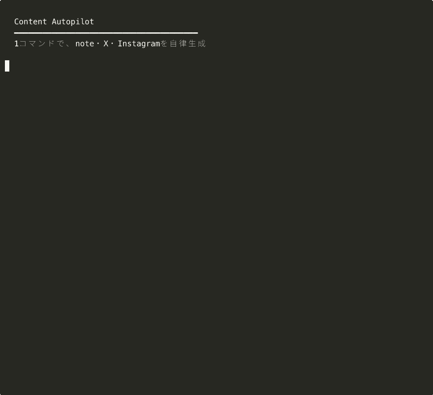
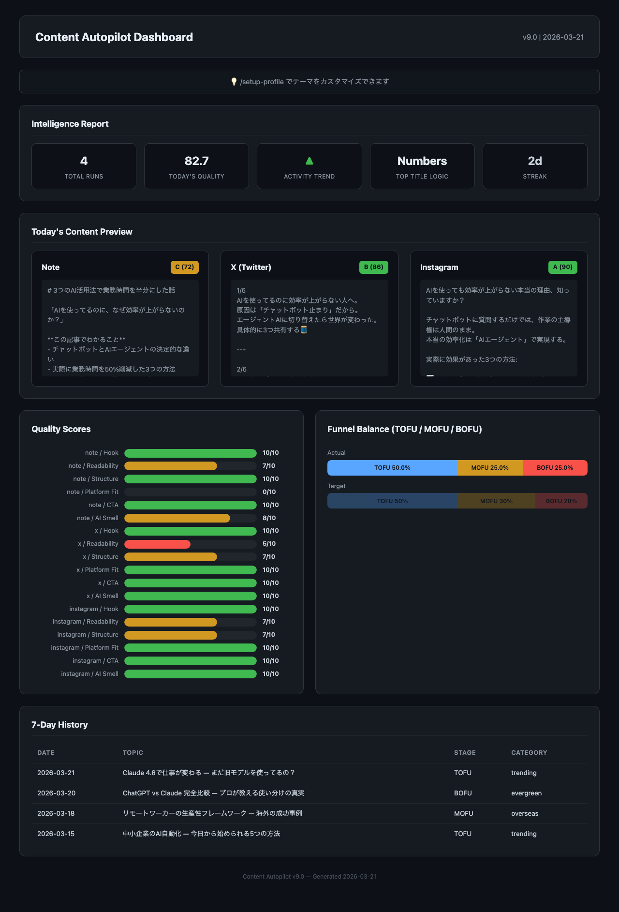

<h1 align="center">Content Autopilot</h1>

<p align="center">
<strong>コンテンツ制作に毎日3時間かけていませんか？<br>
1コマンドで、note・X・Instagramを同時に自律生成します。</strong>
</p>

---

## 問題

コンテンツクリエイターの現実:

- トレンド調査に**30分**、3プラットフォームへの書き分けに**2時間**、品質チェックに**30分**
- 疲れた日は質が落ちる。忙しい日はスキップ。**継続が最大の壁**
- AIに書かせても「本記事では〜」「さまざまな方法が〜」— **AI臭くて使えない**

## 解決

`/daily-autopilot` の1コマンド。あとは全て自律。



```
━━━━ Content Autopilot ━━━━━━━━━━━━━━━━━━
[1/8] Profile → 初回は自動作成（セットアップ不要）
[2/8] Funnel分析 → MOFU不足を検出 → MOFU記事に決定
[3/8] WebSearch → トピック自動選択
[4/8] note(2,500字) + X(6tweets) + IG → 同時生成
[5/8] 6軸品質採点 → 94/100 ✓
[6/8] 公開前チェック → 8/8 通過 ✓
[7/8] Dashboard → ブラウザ自動表示
[8/8] note.com投稿画面 + X投稿画面 → 自動起動
━━━━━━━━━━━━━━━━━━━━━━━━━━━━━━━━━━━━━━━━━━
```

品質が低い場合は**自動で改善** — 人間に修正を求めません:
```
note: 68/100 → 密度不足 + AI臭を自動検出 → 修正
note: 82/100 ✓ (自動改善 +14点)
```

## 証拠

### 品質: Claude直接 vs Content Autopilot

```
Claude直接:       56/100 (D) — AI臭5パターン、467文字
  → "本記事では、AIを活用した業務効率化について解説します。"

Content Autopilot: 94/100 (A) — AI臭ゼロ、2,000文字
  → "「AIを使ってるのに、なぜ効率が上がらないのか？」"
```

`python3 run_pipeline.py --compare` で実際に確認できます。

### 生成されるnote記事

```markdown
# 3つのAI活用法で業務時間を半分にした話

「AIを使ってるのに、なぜ効率が上がらないのか？」

**この記事でわかること**
- チャットボットとAIエージェントの決定的な違い
- 実際に業務時間を50%削減した3つの方法
- 明日から始められる導入ステップ
```

### ダッシュボード



### 外部連携（8サービス実証済み）

| サービス | 連携内容 | 実証 |
|---------|---------|------|
| **Notion** | 記事をページに自動保存 | ✓ |
| **Gmail** | HTML下書きに自動保存 | ✓ |
| **Gemini** | OGP画像を自動生成 | ✓ |
| **Google Analytics** | PVデータ→分析 | ✓ |
| **Google Calendar** | 投稿リマインダー登録 | ✓ |
| **note.com** | エディタ自動起動（MCP不要） | ✓ |
| **X** | 投稿画面プリフィル（MCP不要） | ✓ |
| **Zapier** | X/IG投稿トリガー | 定義済み |

---

## 試す

```bash
# Claude Codeで
/plugin marketplace add FP-sudo/content-autopilot
/plugin install content-autopilot@content-autopilot
/daily-autopilot

# ターミナルで（Claude Code不要）— ワンライナーで試せます
git clone https://github.com/FP-sudo/content-autopilot.git && cd content-autopilot/plugins/content-autopilot/scripts && python3 run_pipeline.py
python3 run_pipeline.py --compare    # 品質比較デモ
python3 test_scripts.py              # 23テスト確認
```

---

## Claudeに直接頼むのと何が違うか

Claudeは優秀なライターですが、**セッションを跨いだ記憶と定量的な品質管理**はできません:

| Claudeにできないこと | Content Autopilotの実装 |
|---|---|
| 過去の履歴を覚える | `content-history.json` にセッション跨ぎで蓄積 |
| ファネルバランスを計算する | TOFU/MOFU/BOFU比率を自動計算・自動調整 |
| 毎回同じ基準で採点する | 6軸・10パターンで定量採点 |
| ダッシュボードを生成する | HTMLで品質・ファネル・履歴を可視化 |

---

## 品質採点（6軸）

| 軸 | チェック内容 | 例 |
|---|---|---|
| フック | 冒頭で読者を掴めるか | 40文字以内の疑問・数字 |
| 可読性 | 段落長、文体一貫性 | 漢字率20-40% |
| 構造 | 見出し・まとめ | 3-7個の##見出し |
| 適合性 | プラットフォーム要件 | note: 2000字以上 |
| CTA | 行動喚起 | フォロー誘導 |
| AI臭 | AI特有パターン検出 | 10パターン自動除去 |

## コマンド

| コマンド | 機能 |
|---------|------|
| `/daily-autopilot` | 全自律パイプライン |
| `/setup-profile` | テーマ・文体カスタマイズ |
| `/trend-scout` | トレンドリサーチ |
| `/publish` | Notion/Gmail/Zapierに連携 |
| `/schedule` | カレンダーにリマインダー登録 |
| `/content-analytics` | コンテンツ分析 |
| `/log-performance` | PV・いいね数→学習 |

## 技術構成

```
plugins/content-autopilot/
├── skills/      129 SKILL.md
├── scripts/     12 Python scripts (4,000+ LOC)
├── commands/    9 slash commands
└── tests        23/23 pass
```

## License

MIT
